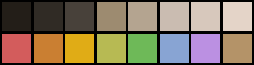

# base16-woodland-scheme

A palette for the [base16](https://github.com/chriskempson/base16) color scheme, based on a gradient of deep browns through soft whites, and a selection of pastels found in the forest.

  

Here is a [preview](https://imgur.com/a/UPBm6) of the scheme in several applications.

To install, please use the [base16 builders](https://github.com/chriskempson/base16).
